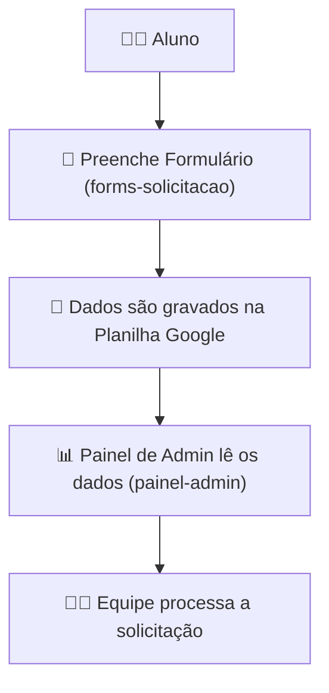

# Central de Solicitações e Administração de Certificados

## Visão Geral

Este repositório contém a solução completa para a gestão de solicitações de certificados acadêmicos, composta por dois projetos principais que trabalham em conjunto:

1.  Um **formulário público** para que os alunos possam submeter os seus pedidos.
2.  Um **painel de administração** interno para que a equipa académica possa gerir, processar e dar seguimento a essas solicitações.

Construído inteiramente sobre o ecossistema Google, este sistema visa automatizar o fluxo de trabalho, centralizar a informação e fornecer ferramentas robustas para a gestão de documentos como declarações e históricos académicos.

---

## Estrutura do Repositório

O projeto está dividido em duas pastas principais, cada uma contendo uma aplicação web independente:

### 📁 [`/forms-solicitacao`](forms-solicitacao)

Contém a aplicação web do **Formulário de Solicitação de Certificado**. Esta é a interface pública que os alunos utilizam para enviar os seus dados.

* **Responsabilidade:** Recolher os dados dos alunos de forma estruturada e segura.
* **Destino dos Dados:** Grava cada nova solicitação diretamente numa Planilha Google que serve como base de dados central.

➡️ [**Acesse ao README do Formulário de Solicitação**](forms-solicitacao/v02/README.md)

### 📁 [`/painel-admin`](painel-admin)

Contém a aplicação web do **Painel de Administração de Solicitações**. Esta é a ferramenta interna para a equipa da secretaria.

* **Responsabilidade:** Ler, gerir, processar e dar seguimento às solicitações recebidas.
* **Fonte dos Dados:** Lê os dados diretamente da mesma Planilha Google que é alimentada pelo formulário.

➡️ [**Acessar ao README do Painel de Administração**](./painel-admin/README.md)

---

## Fluxo de Dados Simplificado

## 📄 Licença

Este projeto está licenciado sob os termos da [Creative Commons Atribuição-NãoComercial 4.0 Internacional (CC BY-NC 4.0)](https://creativecommons.org/licenses/by-nc/4.0/).

Você pode usá-lo, modificá-lo e compartilhá-lo **para fins não comerciais**, desde que com a devida atribuição a **Vitor Krewer**.  
Para qualquer uso comercial, entre em contato diretamente.

---

## 🤝 Contato

[LinkedIn](https://www.linkedin.com/in/vitorkrewer) • [Email](mailto:vitormkrewer@gmail.com)
