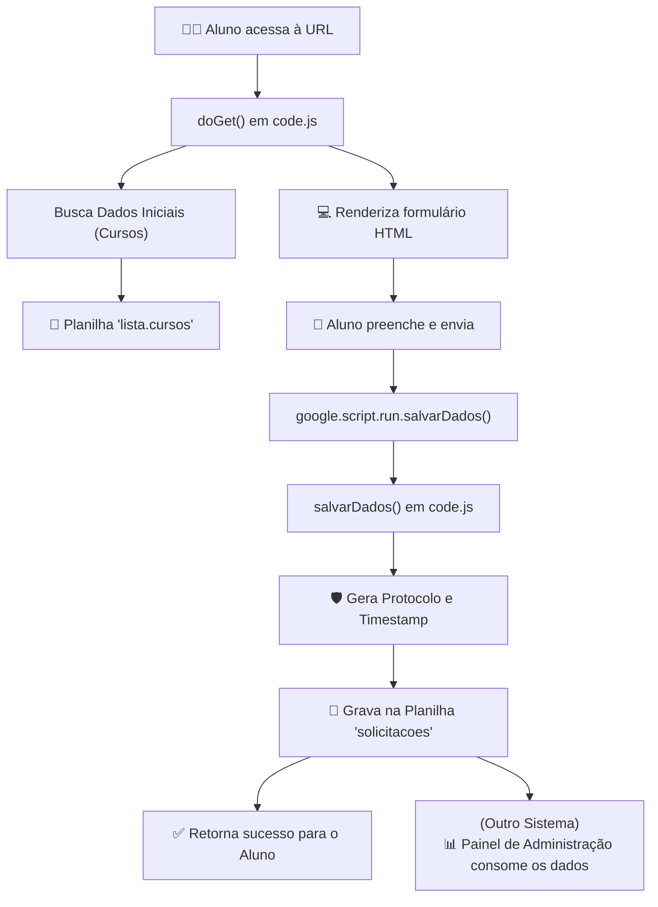

# Arquitetura e Fluxo de Dados

A arquitetura do Formulário de Solicitação foi desenhada para ser simples, segura e eficiente, utilizando os recursos nativos do Google Apps Script.

  
  

## Componentes do Sistema

O projeto é composto por dois ficheiros principais que separam as responsabilidades de back-end e front-end.

### 1. Back-end (`code.js`)

É um script do lado do servidor que corre nos servidores da Google. As suas principais responsabilidades são:

* **Servir a Interface (`doGet`):** Quando um utilizador acede à URL da aplicação, a função `doGet(e)` é executada. Ela carrega o ficheiro HTML, injeta os dados dinâmicos (lista de cursos e links de pagamento) e envia a página renderizada para o browser do utilizador.
* **Processar o Envio de Dados (`salvarDados`):** Quando o aluno preenche e envia o formulário, a função `salvarDados(formData)` é chamada. Ela recebe os dados, gera um protocolo, adiciona um timestamp e grava tudo como uma nova linha na Planilha Google de destino.
* **Fornecer Dados Dinâmicos:** Funções como `getCursos()` e `getPaymentLinks()` leem informações da planilha ou de constantes no código para popular o formulário, tornando-o adaptável sem necessidade de alterar o HTML.

### 2. Front-end (`solicitacao.html`)

É um ficheiro HTML que contém toda a estrutura da página, o estilo (CSS) e a lógica de interatividade do lado do cliente (JavaScript).

* **Estrutura (HTML):** Define todos os campos do formulário, os acordeões de informação e as áreas de feedback para o utilizador.
* **Estilo (CSS):** Utiliza o framework Bootstrap para um design responsivo e adiciona estilos personalizados para se alinhar com a identidade visual da instituição.
* **Interatividade (JavaScript):**
    * Controla a lógica da interface, como popular os menus dropdown de UF e instituições.
    * Cria interações dinâmicas, como carregar a lista de cursos correta quando uma instituição é selecionada.
    * Realiza validações no lado do cliente (ex: verificar se os termos foram aceites).
    * Comunica com o back-end através da API `google.script.run` para enviar os dados do formulário.
---

### **Convenção de Nomenclatura de Ficheiros (`.js` vs `.gs`)**

Para fins de desenvolvimento e compatibilidade com ferramentas de edição de código (como o Visual Studio Code), os ficheiros de back-end neste repositório utilizam a extensão `.js`. Isto ativa o *syntax highlighting*, a formatação e outras funcionalidades específicas da linguagem JavaScript.

No entanto, é crucial notar que, ao criar ou copiar estes ficheiros para o ambiente de desenvolvimento nativo do **Google Apps Script**, a extensão correta e esperada pela plataforma é **`.gs`** (Google Script).

Como padrão, o arquivo `.js` que sempre equivalerá com `.gs` será o **`code`** (Google Script), contendo todas as funções a nível de AppScript.

### Convenção para Front-end
Da mesma forma, os ficheiros que contêm código JavaScript do lado do cliente (front-end) utilizam a extensão `.html` (ex: `application.js.html`), pois são injetados diretamente numa página HTML servida pelo Google Apps Script.

**Em resumo:**

| Extensão no Repositório | Tipo de Código | Extensão no Editor Apps Script |
| :--- | :--- | :--- |
| `.js` | Back-end (lado do servidor) | `.gs` |
| `.html` | Front-end (HTML, CSS, JavaScript) | `.html` |
| `.js` | Front-end (JavaScript) | `.js.html` |
| `.css` | Front-end (CSS) | `.css.html` |

No caso de funções javascript que trabalham diretamente com o HTML, adotou-se como padrão, utilizar dentro do `.html` `"<?!= include('application.js'); ?>"`, separando o javascript com o objetivo de evitar códigos monolíticos, facilitar a manutenção e desenvolvimento de novas funções.

Os arquivos "application.js.html" devem contar obrigatoriamente tags `` para que seja interpretado corretamente.

A mesma lógica se aplica aos arquivos relativos as folhas de estilo ao utilizar tags `` e incluir no `.html` <?!= include('style.css'); ?> antes de fechar a tag <head>

Esta menção é importante e serve como um guia para futuros projetos e para qualquer desenvolvedor, ou usuário, que venha a trabalhar neste código ou realizar a implantação em seu projeto em Google App Script.

---

## Fluxo de Dados

O fluxo de dados desde o aluno até à base de dados é linear e seguro.

